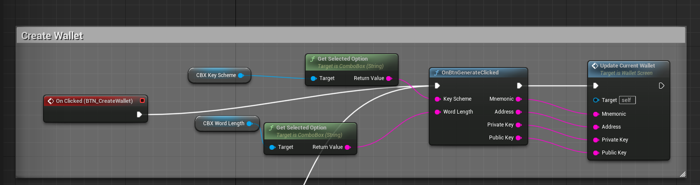
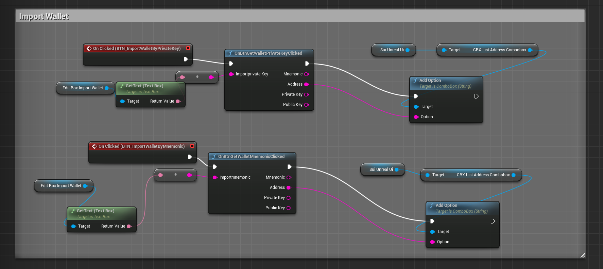
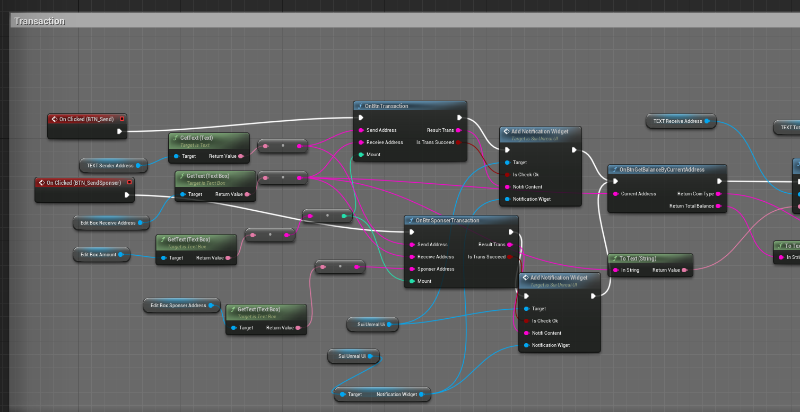
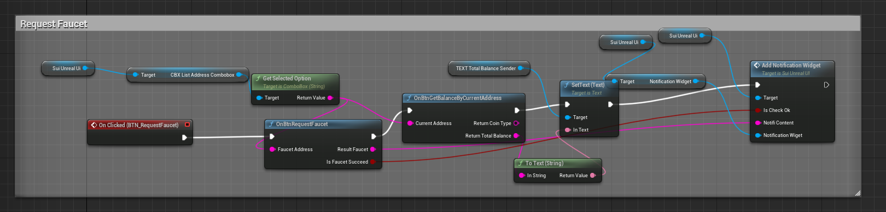
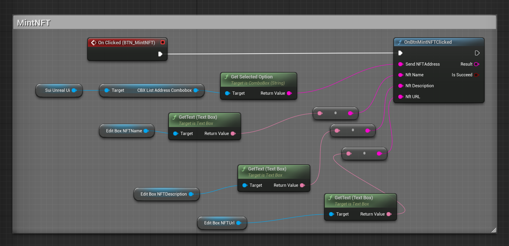
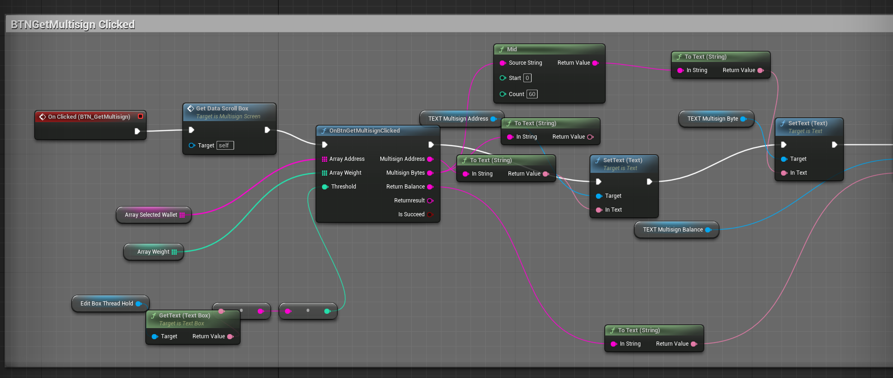

<p align="center">
	
</p>


# Unreal-Sui-SDK #

Unreal-Sui-SDK is a sample example to help developers integrate Sui blockchain technology into their C++ and Unreal projects.

- [Project Layout](#project-layout)
- [Features](#features)
- [Requirements](#requirements)
- [Dependencies](#dependencies)
- [Installation](#installation)
- [Using Unreal-Sui-SDK](#using-unreal-sui-sdk)
- [Using Unreal-Sui-SDK with Blueprint](#using-unreal-sui-sdk-with-blueprint)
- [Examples](#examples)
- [License](#license)

### Project Layout ###  

1. **`Config/`**:: This directory contains the project's configuration files, including INI files used to set various project parameters .
2. **`Content/`**:: This directory contains all the project's content assets.
3. **`Lib/`**:: This directory contains the libsui_rust_sdk.dylib library and header files to use the functions in the library.
4. **`Resource/`**:: A place for various resources needed for the project, like images, data files, or other assets.
5. **`Source/`**: This directory contains the project's C++ source code.

### Features ###

#### General
- [x] Compatibility with main, dev, and test networks.
- [x] Integration with Sui blockchain using native libraries.
- [x] Cross-platform support (macOS, Windows, Linux).

#### NFT
- [x] Mint new NFTs.
- [x] Transfer NFTs to other addresses.
- [x] Retrieve wallet objects related to NFTs.
- [x] Conversion between raw and managed data structures for NFT objects.

#### BCS
- [x] Basic serialization and deserialization of Sui types.
- [x] Support for various Sui types including integers, floats, booleans, strings, and addresses.
- [x] Conversion of Sui types to BCS (Binary Canonical Serialization) format.

#### SuiMultisig
- [x] Create and manage multisig wallets.
- [x] Create transactions from multisig wallets.
- [x] Sign and execute transactions using multisig wallets.
- [x] Handling of multisig data structures and transaction results.

#### SuiTransactionBuilder
- [x] Create and manage transaction builders.
- [x] Add various types of commands to transactions (e.g., move call, transfer object, split coins, merge coins).
- [x] Execute transactions with or without a sponsor.

#### SuiWallet
- [x] Singleton pattern for easy access to wallet functionalities.
- [x] Generate new wallets with specified key schemes and word lengths.
- [x] Import wallets from private keys.
- [x] Import wallets from mnemonics.
- [x] List all wallets.
- [x] Display wallet details.
- [x] Generate and add new keys to the wallet.


### Requirements ###

| Platforms                              | Unreal Version | Installation           | Status       |
| -------------------------------------- | ------------- | ---------------------- | ------------ |
| Mac / Linux                            | Unity engine 5.4| 3rd lib build config| Fully Tested |


### Dependencies
- https://github.com/VAR-META-Tech/Rust2C-Sui-SDK

### Installation ###
# Installation Guide

This guide provides step-by-step instructions for installing and setting up on macOS platforms. Ensure you have the following prerequisites installed to build the project:

## Prerequisites
- **Visual Studio Code** with C++ development environment
- **Install Sui** Follow this guide to install Sui https://docs.sui.io/guides/developer/getting-started/sui-install
## Project Setup
Run follow command to setting Envỉroment befor testing:
1. Check Sui Client Environment:  
    ```sh 
    Sui client envs
    ```
 **NOTE:If you dont have DevNet Please Run CMD :**
```sh 
    sui client new-env --alias devnet --rpc https://fullnode.devnet.sui.io:443
```
2. Switch to devnet network: 
    ```sh 
    sui client switch --env devnet
    ```
3. Check current network:
    ```sh 
    sui client active-env
    ```
 **NOTE: The return should be devnet**
 
4. Get the active address: 
    ```sh
    sui client active-address
    ```
5. Request token:
    ```sh
    sui client faucet 
    ```
 **NOTE: Wait for 60s to get the tokens**

6. Check the gas coin objects for the active address: 
    ```sh
    sui client gas
    ```

### Using Unreal-Sui-SDK
Unreal-Sui-SDK can integrate into your own Unreal projects.
We have two options to run the project:

   1. Open the Unreal project directly through the SuisdkUnreal.uproject file and then click the Run icon to test.
    
   2. Open the project using Visual Studio Code, build the source code, and run the test.

For option 2 you need define Build.cs to integration libsui_rust_sdk.dylib library with Unreal engine.
Here is an example:
```cshape
// Fill out your copyright notice in the Description page of Project Settings.

using UnrealBuildTool;
using System.IO;
using System;
public class SuisdkUnreal : ModuleRules
{
	public SuisdkUnreal(ReadOnlyTargetRules Target) : base(Target)
	{
		PCHUsage = PCHUsageMode.UseExplicitOrSharedPCHs;
		PublicDependencyModuleNames.AddRange(new string[] { "Core", "CoreUObject", "Engine", "InputCore", "UMG", "Json", "JsonUtilities", "HTTP", "ImageWrapper" });
		PrivateDependencyModuleNames.AddRange(new string[] { "Slate", "SlateCore" });
		PrivateDependencyModuleNames.AddRange(new string[] { });
		if (Target.Platform == UnrealTargetPlatform.Mac)
		{
			string unreal_sui_sdk_LibPath = Path.Combine(ModuleDirectory, "../../Lib/", "libsui_rust_sdk.dylib");
			string destinationDirectory = Target.ProjectFile.Directory.FullName;
			PublicAdditionalLibraries.Add(unreal_sui_sdk_LibPath);
			PublicIncludePaths.AddRange(new string[] { Path.Combine(ModuleDirectory, "../../Lib/") });
			PublicIncludePaths.AddRange(new string[] { Path.Combine(ModuleDirectory, "../../../") });
		}
		CppStandard = CppStandardVersion.Cpp17;
	}
}

```

##### Import Wallet from Private Key
To import a wallet using a private key:
```cpp
    ImportResult *result = import_from_private_key(PRIVATE_KEY_BASE64);
    printf("Status: %d\n", result->status);
    printf("Address: %s\n", result->address);
    printf("Error: %s\n", result->error);
```

### Using-Unreal-Sui-SDK-with-blueprint
**Create Wallet**


**Import Wallet**


**Send Transaction**


**Request Faucet**


**MintNFT**


**Multisign**


### Examples ###

The SDK comes with several examples that show how to leverage the Rust2C-Sui-SDK to its full potential. The examples include Wallet Creation and Management, Token Transfers,  NFT Minting, Account Funding, and Multi-signature.


### License ###
This project is licensed under the Apache-2.0 License. Refer to the LICENSE.txt file for details.
